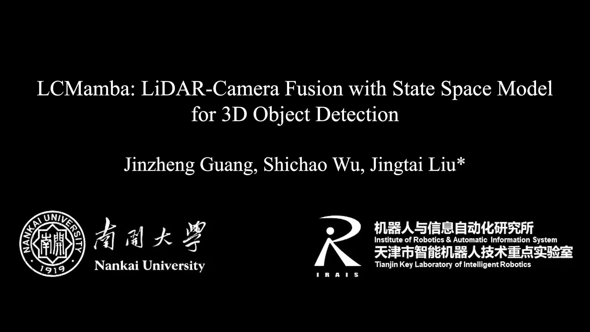

# LCMamba

Official PyTorch implementation of LCMamba: LiDAR-Camera Fusion with State Space Model for 3D Object Detection.

### [https://www.youtube.com/watch?v=Z9GfZ8zwTMs](https://www.youtube.com/watch?v=Z9GfZ8zwTMs)

[](https://youtu.be/Z9GfZ8zwTMs "")


## Updates

- **(2025-01-25)** 🔥 We release the code and model of our LCMamba.


## Main Results

### 3D Object Detection on nuScenes test

| Model | Modality | mAP | NDS | Results / Log |
|:-----------:|:---------:|:-------:|:----------:|:--------:|
| LCMamba (Ours) |    LiDAR+Camera     |    69.65%     | 72.13% | [LCMamba-test.json](https://github.com/jinzhengguang/LCMamba/releases/download/v1.0/LCMamba-test.json) / [LCMamba-test.txt](https://github.com/jinzhengguang/LCMamba/releases/download/v1.0/LCMamba-test.txt) 


### 3D Object Detection on nuScenes validation

| Model | Modality | mAP | NDS | Checkpoint / Log |
|:-----------:|:---------:|:-------:|:----------:|:--------:|
| Camera-Only Baseline |    Camera     |    35.56%     | 41.21% | [Camera-Only](https://github.com/HuangJunjie2017/BEVDet) |
| LiDAR-Only Baseline |    LiDAR     |    64.68%     | 69.28% | [LCMamba_lidar.pth](https://github.com/jinzhengguang/LCMamba/releases/download/v1.0/LCMamba_lidar.pth) |
| LCMamba (Ours) |    LiDAR+Camera     |    69.65%     | 72.13% | [LCMamba.pth](https://github.com/jinzhengguang/LCMamba/releases/download/v1.0/LCMamba.pth) / [LCMamba.log](https://github.com/jinzhengguang/LCMamba/releases/download/v1.0/LCMamba.log) 


## Requirements

- `python>=3.10`
- `PyTorch>=2.1.2`
- `Cuda>=11.8`
- `mmcv>=2.1.0`
- `mmdet>=3.2.0`
- `causal_conv1d==1.5.0` 
- `mamba_ssm==2.2.4`

### Installation

```shell
pip install -v -e .
python LCMamba/setup.py develop
```


## nuScenes dataset

Download [nuScenes dataset](https://www.nuscenes.org/) under `PROJECT/data/nuscenes`.

The folder structure should be organized as follows before our processing.

```
LCMamba
├── LCMamba
├── data
│   ├── nuscenes
│   │   ├── maps
│   │   ├── samples
│   │   ├── sweeps
│   │   ├── v1.0-test
|   |   ├── v1.0-trainval
```

Dataset Preparation

```shell
python tools/create_data.py nuscenes --root-path ./data/nuscenes --out-dir ./data/nuscenes --extra-tag nuscenes
```


## Model Training and Inference

### Training

If you want to train the LiDAR-only detector for 3D object detection, please run:

```shell
./tools/dist_train.sh LCMamba/configs/LCMamba_lidar.py 4
```

If you want to train the LiDAR-Camera Fusion detection model for 3D object detection, please run:

```shell
./tools/dist_train.sh LCMamba/configs/LCMamba_lidar_cam.py 4 --cfg-options load_from=LCMamba_lidar.pth model.img_backbone.init_cfg.checkpoint=swint-nuimages-pretrained.pth
```

### Evaluation

We also provide instructions for evaluating our pretrained models. Please download the checkpoints using the following script:

```shell
./tools/dist_test.sh LCMamba/configs/LCMamba_lidar_cam.py LCMamba.pth 4
```

## Acknowledgement

- BEVFusion-MIT [(link)](https://github.com/mit-han-lab/bevfusion)
- BEVFusion [(link)](https://github.com/ADLab-AutoDrive/BEVFusion)
- Mamba [(link)](https://github.com/state-spaces/mamba)
- VMamba [(link)](https://github.com/MzeroMiko/VMamba)
- MMDetection3D [(link)](https://github.com/open-mmlab/mmdetection3d)

## Contact Information

If you have any suggestion or question, you can leave a message here or contact us directly: guangjinzheng@qq.com. Thanks for your attention!

